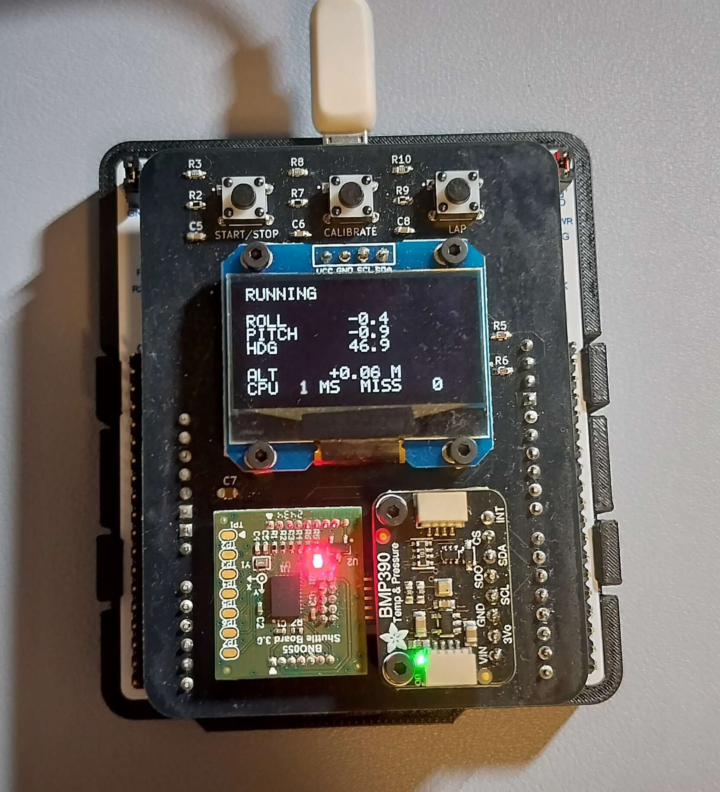
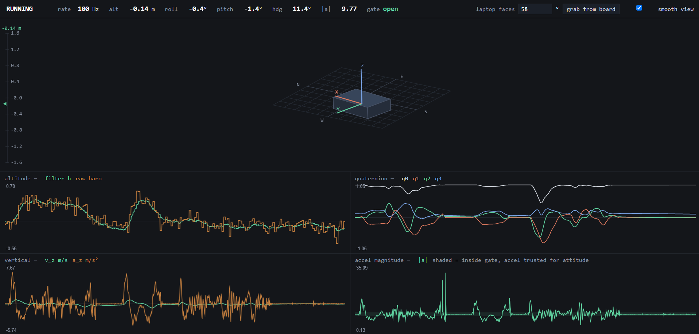

# Inertial State Estimation

  
  

This an online attitude and altitude estimator built around an extended Kalman filter. The filter is written and tested in MATLAB and Simulink against a simulated plant, then generated to single-precision C with MATLAB Coder and run on an STM32G4 Nucleo with a custom sensor shield. It does not estimate horizontal position. Nothing on the board observes it, so the only way to get it would be double-integrating acceleration, and that drifts without bound.

There are ten states: an orientation quaternion, a three-axis gyroscope bias, and a vertical channel of acceleration, velocity and altitude. The gyroscope propagates orientation forward and three measurements correct it. The accelerometer gives a gravity reference for roll and pitch, the magnetometer gives heading once local declination is applied, and the barometer gives altitude through the standard atmosphere model. Gravity is only worth trusting when the device is not accelerating, so accelerometer corrections to attitude get dropped whenever specific force is more than ten percent off *g*. The same sample still drives the vertical acceleration state. All of this is tested first against a Simulink plant with rigid-body motion, sensor noise and bias, and an earth magnetic field model.

The firmware runs a 100 Hz tick and spends about 1.5 ms of each 10 ms period inside the generated filter. The BNO055 is read in raw AMG mode, so fusion happens in the filter rather than in the sensor. The BMP390 runs at x32 oversampling, which holds its noise near 0.9 Pa. Three buttons move the board between idle, calibration and running, with status shown on a small OLED, and the whole state goes out over serial every tick to a browser dashboard that draws the device in a north-fixed frame.

## Repository

- Simulation/EKF - filter math, parameters, and the code generation entry point
- Simulation/Plant - Simulink plant and sensor models
- Simulation/Codegen - generated C for the filter
- Firmware - STM32 application and device drivers
- Electrical - KiCad schematic, PCB, and fabrication outputs for the shield
- Scripts - build, flash, and source sync helpers, plus the live dashboard
- Docs - images
